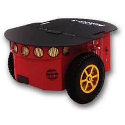

# p3dx-driver-board
An effort to reverse-engineer the Adept MobileRobots Pioneer-3DX's driver board.

## Rationale

The [P3DX](https://www.generationrobots.com/media/Pioneer3DX-P3DX-RevA.pdf) is a nice, featureful, and self-contained robotics platform that was released sometime in the early '00s. We have three of those in our laboratory, and they're currently big red paperweights, as their SDK is no longer mantained; to my knowledge, the ROSARIA module that was used with ROS1 to control those robots has not been ported to ROS2, and their ARIA protocol is not documented.

There've been some efforts to produce libraries that can interface with the on-board microcontroller by figuring out how the protocol works, like [Purdue's P2OS driver](https://github.com/allenh1/p2os/tree/main), which is an open-source module for ROS that includes an ARIA driver -- their (C++) packet driver is under `p2os_driver/packet` and `p2os_driver/sip`.

I like the construction and the modularity of the P3DX: the driver board is completely separated from the MCU board, probably because the original designers already had upgradability in mind, and they're connected through a ribbon cable. Since the MCU board is not integral to the operation of the robot's electronics, I decided to figure out the pinout of the ribbon cable so that we could try to attach a different MCU or a Raspberry Pi to the driver board without too much effort, so that our students may still play with the P3DXes and learn from their operation.

## Architecture

The driver board has:
- Power control and generation circuitry for the +12V and +5V rails;
- Two H-bridges -- one for each motor;
- Connections for IR sensors and encoders;
- Optional connections for a fan, a charger, and temperature sensors to be mounted on the motors;

There are a couple of ICs on the board: two STM TD340 MOSFET drivers to control the H-Bridge, a couple of STM TS922I Op-Amps, and two TI SN74HC14 Schmitt-Trigger Inverters. Look under the [datasheets/](datasheets/) folder if you need to look something up.

## Disclaimers

Obligatory disclaimers:
- I take absolutely no credit for the design of the driver board.
- This was an independent effort I made in my spare time; my institution is not affliated with this in any way, shape, or form.
- I decided to release the schematics I came up with under Public Domain because, as far as I know, this platform has been long since abandoned. If you feel like this is infringing your IP rights, please file a DMCA request and I'll take this down.
